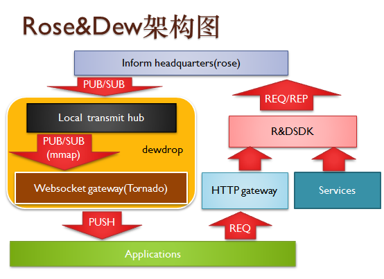
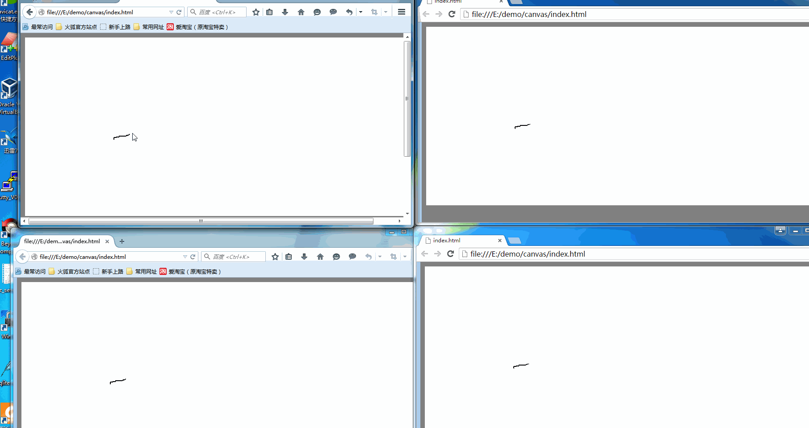

## What is Rose&Dewdrop?
######Rose&Dewdrop 是一个基于tornado和zeromq的分布式websocket消息发布组件
* 其中rose构建于zeromq主要承担消息发布中心角色(iHQ)
* dewdrop构建于tornado并集成一个小型HUB(PUB/SUB)发布中心
* rndsdk则承担给rose节点下达消息发布作业的角色

* 疑问请联系(rowland.lan@163.com)

##架构设计
* dewdrop中tornado集成一个zeromq的PUB/SUB的迷你hub(使用ipc协议)，每个websocket会绑定一个sub订阅这个本机hub
* 本机hub同时订阅所有的rose-ihq节点，一旦rose-ihq发布消息，本地迷你hub做一次转发
* rndsdk是用来给rose iHQ下达消息作业的

## 为什么tornado节点不直接把websocket连接绑定zsocket sub到rose-ihq而是一个本地的HUB？

* 好处主要有两个
    *   如果直接把tornado的websocket连接直接绑定到rose-ihq，那么rose-ihq的压力会很大，假设3个tornado节点每个节点10万连接，那么rose就要承担30万连接
    *   另一个好处就是rose节点挂掉不会导致前端设备与tornado的连接中断，未来只需要恢复rose-ihq，前端可以无痛感知

* 坏处有一个
    *   由于每个websocket连接进来需要绑定一个sub到迷你hub中去,这样就会产生两个zeromq连接,而一个zeromq连接会消耗两个fd,所以等于每个websocket客户端连接进来都会
    消耗5个fd资源, 所以如果要达到100万并发连接你至少需要配置500万fd.

##演示
######实例在demo中，先把dewdrop的serv.py跟rose的ihq.py跑起来，然后运行sdk中wand的test2，是一个每几十毫秒生成一条广播股价的服务，然后在浏览器中打开index.html看效果。可以试着停止一下rose节点中断消息的发送，过一段时间再度开启，可以发现前端的webosket依旧可以继续接收消息，从而验证了这种架构的可靠性。

